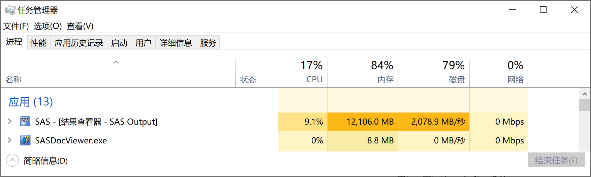
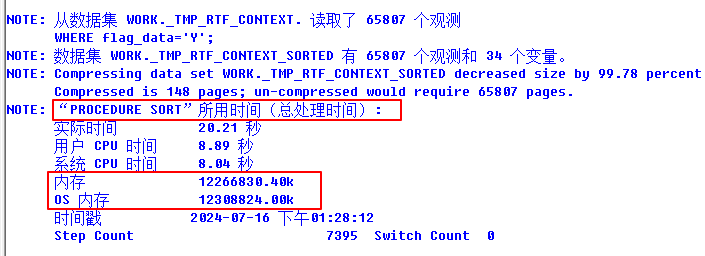
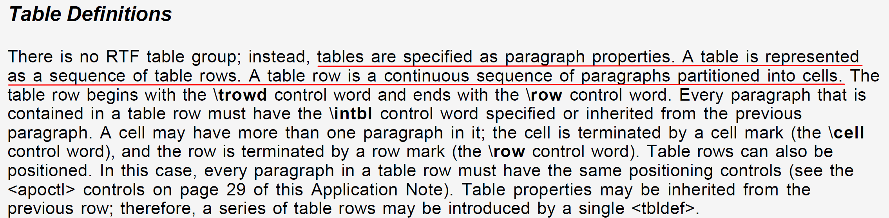
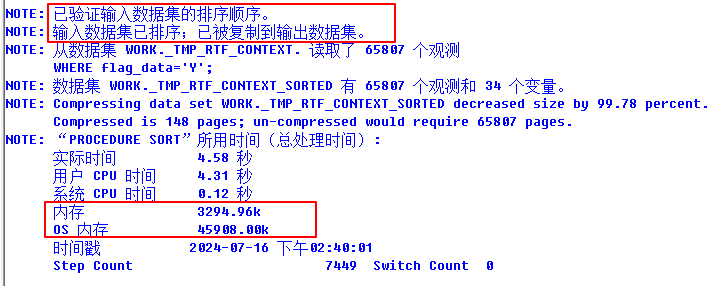

## 危机产生

在一次对 TFL 进行 QC 的过程中，偶然发现某个宏程序在执行过程中会消耗大量内存，最高内存使用量甚至达到了 12GB。



## 分析原因

该宏程序（%ReadRTF）的作用是读取一个 RTF 文件，尝试解析 RTF 文件中的表格存储的数据，并将这些数据转换为 SAS 数据集。将 RTF 文件转换为 SAS 数据集的作用是便于 QC 人员直接在数据集上使用 `PROC COMPARE` 过程进行对比，准确高效，而不必用肉眼将 SAS 结果窗口的内容与 RTF 文档进行比对。对于一些篇幅较长的清单，使用肉眼进行 QC 工作几乎是不可能的。

并非所有 RTF 文件都会导致在运行 %ReadRTF 时消耗大量内存，大部分情况下，由于原始 RTF 文件的体积通常很小（10~200KB），%ReadRTF 运行过程中的内存使用量很难被轻易察觉。

暴露内存使用问题的是一张 6.9MB 的清单，它包含近 3900 条观测，以及 17 个变量，合计约 66300 个数据点，体现在 RTF 代码上，近 14 万行。

#### FULLSTIMER 系统选项

为了进一步找到占用大量内存的罪魁祸首，在运行 %ReadRTF 前指定 `FULLSTIMER` 系统选项，以便在日志中显示完整的系统资源信息，具体如下：

- 实际时间：运行 SAS 任务所消耗的总时间
- 用户 CPU 时间：执行用户代码所消耗的时间
- 系统 CPU 时间：执行系统调用所消耗的时间
- **内存**：运行某个步骤所需的内存量
- **OS 内存**：运行某个步骤向系统申请的最大内存量

指定 `FULLSTIMER` 后，尝试运行 %ReadRTF，在给出的日志中，定位到了问题所在，如下图：



这是一个用于对数据集排序的 `PROC SORT` 过程，在这次调用中，它向系统申请（OS 内存）并消耗（内存）了约 12GB 的内存。

查看源代码：

```sas
/*以纯文本形式读取RTF文件*/
data _tmp_rtf_data(compress = &compress);
    informat line $32767.;
    format line $32767.;
    length line $32767.;

    infile "&fileloc" truncover;
    input line $char32767.;
run;

/*
...
set _tmp_rtf_data ...
...
data _tmp_rtf_context ...
...
*/

/*生成SAS数据集*/
proc sort data = _tmp_rtf_context(where = (flag_data = "Y")) out = _tmp_rtf_context_sorted(compress = &compress);
    by obs_seq obs_var_pointer;
run;

proc transpose data = _tmp_rtf_context_sorted out = _tmp_outdata prefix = COL;
    var context;
    id obs_var_pointer;
    by obs_seq;
run;
```

结合源代码上下文，可以得知这里使用 `PROC SORT` 过程的目的是为了确保读取 RTF 文件后，中间处理步骤中的数据集按照正确的顺序对观测进行排序，以便下一步使用 `PROC TRANSPOSE` 进行转置时，`by` 语句不会产生错误。

进一步研究 RTF 语法，发现在 RTF 1.6 Specification 中，表格的每一行被视为一个段落，表格行与行之间的相对位置关系与对应 RTF 代码定义的相对位置关系一致，也就是说，使用 SAS 软件生成 RTF 后，再使用 `infile` 语句进行读取，此时观测的排序极有可能已经完成了。



对于数据量比较小的 RTF 文件，重复排序带来的内存消耗微乎其微，但若遇到数据量庞大的 RTF 文件，重复排序导致的内存消耗问题就不容忽视了。

## 危机解决

查阅帮助文档，发现 `PROC SORT` 过程提供了一个选项 `PRESORTED`，这个选项可以在强烈怀疑数据集已经正确排序的情况下使用。

若指定了 `PRESORTED` 选项，SAS 系统会在排序之前，检查输入数据集内观察结果的顺序是否正确。若正如所预料的那样已经完成了排序，则不会重复排序，由于“检查是否排序”比“直接进行排序操作”本身更快且消耗的内存更少，故在上述场景下，`PRESORTED` 选项的确带来了性能的可观提升。

如下是使用 `PRESORTED` 选项后，%ReadRTF 运行过程中，排序操作消耗的内存资源：



可以发现，在这次调用中，`PROC SORT` 过程向系统申请和消耗的内存量降低了 3 个数量级。此外，由于检查排序的计算量小得多，过程步所消耗的时间也下降不少。

## 总结

- `FULLSTIMER` 选项可显示程序步（DATA 步和 PROC 步）消耗的完整系统资源，便于开发者对程序进行优化
- `PRESORTED` 选项可在特定情况下避免重复排序，降低系统资源消耗

注意：`PRESORTED` 选项应当仅在非常确定数据集可能已经处于正确排序的状态下使用，若 SAS 检查发现输入数据集未遵循排序顺序，则依然会进行一次排序操作。
