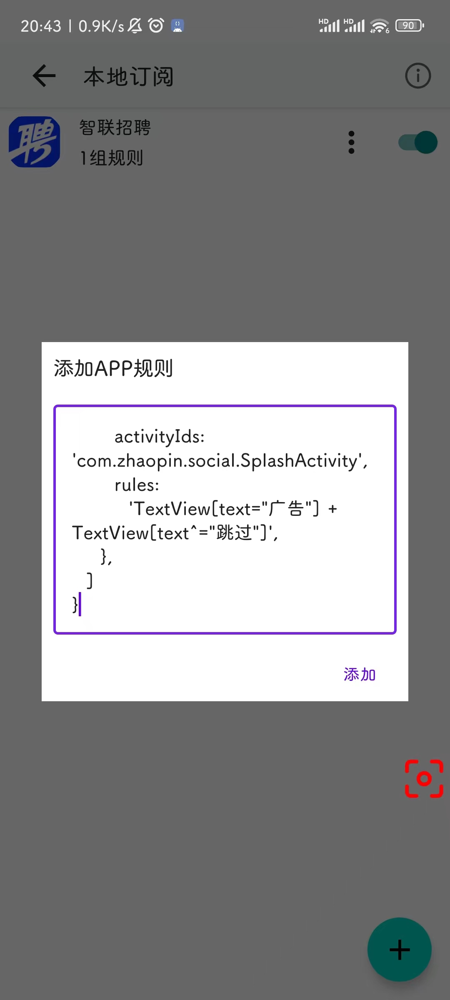

本篇教程主要介绍 GKD 一些用法，太基础的东西就不讲了，主要讲讲跟其他同类 App 相区别的功能：

## 订阅规则

打开 GKD，默认有 3 个订阅选项，分别是【本地订阅】、【内存订阅】和【默认订阅】。

小白打开【默认订阅】的开关即可，默认订阅会不定时更新规则，需要更新的时候开一下联网权限，平时可以关掉联网权限，如果嫌麻烦可以一直打开联网权限，软件开源，怕泄露隐私可以自己去看源码，看不懂源码又怕泄露隐私的建议卸载 GKD。

【内存订阅】供规则编写者调试规则使用，需要配合网页端审查工具使用，普通用户无需关注。

【本地订阅】供需要自定义规则的用户使用，你可以在这里自行编写并添加规则。

如果你订阅了第三方规则，它会显示在默认订阅后面，你应当自行确认第三方规则的安全性（第三方订阅会标注为“未知来源”）。

## 获取快照

GKD 基于订阅制规则，默认订阅可能没有适配某些冷门 App，如果你是小白用户，不会自行编写规则，你可以在需要适配的界面打一个快照，将快照分享给规则编写者，请求支持该 App。具体操作如下：

1. 点击 设置->高级模式，打开悬浮窗服务（您需要开启 GKD 的悬浮窗权限），此时会出现一个红色的快照按钮
2. 在需要适配的界面，点击快照按钮
3. 回到 GKD，点击 设置->高级模式->快照记录
4. 点击需要分享的快照，点击分享，将快照文件发送或保存在你可以找到的任何位置
5. 将快照文件发送给规则编写者（或直接去 github 提交 issue）

点击查看详细图片教程：
http://i0.hdslb.com/bfs/new_dyn/d4cc74d59bfe9754b1c4369d5858806b324618399.png

PS. 推荐直接在 github 提交 issue，并在输入框中直接上传快照，无需使用第三方网盘链接，如果你仍然使用网盘分享链接，且无法直接下载快照文件，则可能会被推迟适配。

PS. 只上传了截图的不会被适配。

点击下载 GKD：https://github.com/gkd-kit/gkd/releases, 蓝奏云：https://lisonge.lanzouy.com/b06e1zoef 密码：gkd

点击去提交 issue：https://github.com/gkd-kit/subscription/issues
