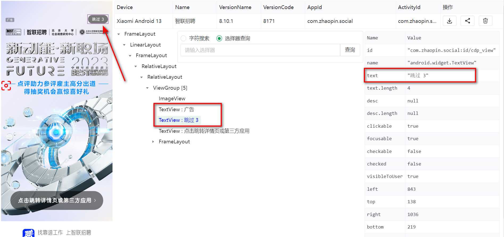
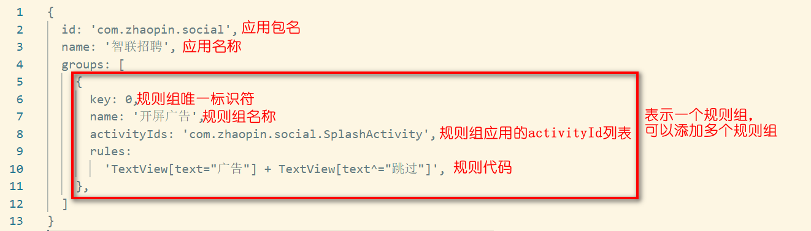

GKD 是一个基于无障碍 + 高级选择器 + 订阅规则的自定义屏幕点击 APP，正如它的名字一样，这款 APP 的作用是让一些操作搞快点，例如：自动签到、自动给 UP 主投币（bushi）。

在 1.2 版本发布之前，GKD 只能使用内置默认订阅的规则，用户无法根据自身的个性化需求进行规则的编写。虽然可以通过内存订阅曲线救国，实现自定义规则，但实际上内存订阅本身是用于辅助规则编写者调试规则的，并不是用来持久化存储存本地规则。

1.2 版本的 GKD 新增了本地订阅，从这个版本开始，用户可以自行编写规则，并持久化存储至本地。鉴于 GKD 规则编写存在一定难度（相较于李跳跳），因此有了这篇教程。

让我们先从熟悉的李跳跳规则开始。李跳跳规则的原理是：先找到一个特征文本，如果找到了特征文本，就去找目标文本，如果找到了目标文本，就去点击目标文本所在的控件。

我们以智联招聘的开屏广告为例，查看开屏广告界面的布局信息（可以使用 GKD 网页端的审查工具 https://github.com/gkd-kit/inspect）：

可以看到，智联招聘开屏广告有一个“跳过”按钮，我们一般称之为“控件”，可以发现这里跳过按钮实际上是一个 TextView 控件，右侧展示了该控件的属性，包括 id, name, text, desc 等等，其中 text 属性包含了 “跳过” 这两个字。另外，旁边还有一个 text 属性为 “广告” 的 TextView 控件。

因此，我们可以写下这么一条规则：{"id":"广告","action":"跳过"}，这条规则我们现在已经很熟悉了，它表示当找到含有文字“跳过”的控件时，就点击含有文字“跳过”的控件。

那么，在 GKD 中，这条规则又该怎么写呢？

GKD 与李跳跳不同，它没有将特征文本和目标文本完全隔离，而是通过检测屏幕上一系列控件的相对位置关系来决定是否执行规则。换言之，李跳跳规则中的 id 和 action 分别对应两个控件，这两个控件在屏幕上的位置可以是任意的，而 GKD 除了需要找到目标控件，还需要检测目标控件和特征控件之间的位置关系是否符合规则的描述。

说了这么多，可能还是没明白什么意思，那就直接看规则吧，上述开屏广告在 GKD 中的规则可以这样写：

TextView[text="广告"] + TextView[text^="跳过"]

看起来比李跳跳要复杂一些，不过不要紧，我们一个一个分析。左边的 TextView[text="广告"] 就表示我们需要寻找的特征节点，这个节点是一个 TextView 控件，并且控件的 text 属性是字符串 “广告”；右边也是类似，只不过 text 属性是一个以 “跳过” 开头的字符串（^=表示以 xxx 开头）。中间的 + 号非常重要，它表示左侧节点和右侧节点之间是兄弟关系，并且是紧挨着的兄弟关系，我们不难在前面展示的节点树中确认这样的关系。

通过上面的例子，我们就能发现，GKD 相对于李跳跳规则的优势了，它可以避免特征节点和目标节点在节点树中相对位置关系不明确的情况下，错误触发规则问题。试想这样一个场景，你在本话题下的评论区分享上述自定义规则，由于分享的文本包含“广告”和“跳过”，李跳跳会频繁点击某条评论，给用户造成困扰。但 GKD 可以避免这种情况，因为在上述自定义规则下，“广告”和“跳过”必须位于两个不同的 TextView 控件，且它们之间的相对位置必须是相邻的兄弟关系。此外，+ 号除了表示相邻的兄弟关系之外，还有另一个隐含信息，即左侧的 TextView 在节点树上的 index 属性值必须小于右侧 TextView 的 index 属性值。

PS. 可以类比 Windows 上的对话框，当按下 tab 键时，程序会根据控件的 index 值从小到大遍历屏幕中的所有控件，这样，你大概能理解 index 属性的含义了。

有时候，我们可能会遇到 “广告” 控件的 index 值比 “跳过” 控件的 index 值大的情况，这时候可以使用 - 号，它表示的位置关系与 + 号是完全相反的，例如：

TextView[text="广告"] - TextView[text^="跳过"]

当然，如果你习惯在节点树中从上往下书写规则，也可以使用 @ 符号，显式指定目标节点，例如：

@TextView[text^="跳过"] + TextView[text="广告"]

这条规则点击的仍然是 “跳过” 按钮，如果你不使用 @ 符号指定点击的目标节点，则默认点击规则的最后一个节点。

到目前为止，我们成功写完了第一条规则，接下来将写好的规则套用到规则模板上即可，为了看起来美观，就直接截图了：

我们按照规则模板，将写好的规则填充进 rules 字段中即可，其他诸如包名、应用名称、activityIds 信息都可以在网页端审查工具直接复制。一个 App 可以填写多个规则组，一个规则组内也可以填写多条规则。例如：某些 App 的开屏广告可能有多种样式，那么就可以在【开屏广告】这个规则组中继续添加 rules 字段即可。

以上就是本期 GKD 规则教程的第一期内容，主要是了解最基本的规则写法，重点是理解 +、-、@ 三个符号的含义。篇幅所限，没有介绍网页端审查工具的使用，可以自行前往 github 查看使用说明。
