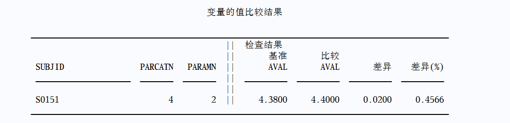

在 SAS base 中，PROC COMPARE 可以比较两个数据集的差异，实际工作中常应用在 ADaM 和 TFL 的 QC 中，下面介绍一些 PROC COMPARE 常用的使用技巧。

## 指定主键

默认情况下，PROC COMPARE 从第一个观测开始，逐行对比两个数据集的观测。在数据集没有增减观测的情况下，这样做一般没有问题。如果两个数据在观测数量上存在差异，PROC COMPARE 的默认比较方式可能会生成大量无用的结果（例如：对 ADSL 进行 QC 时，将受试者 S01047 与 S01048 的观测值进行比较）。

为了避免这种无意义的比较，可以指定数据集的主键，主键是数据库中的一个概念，通过主键可以唯一确定一条观测。PROC COMPARE 的 `ID` 语句可以指定两个数据集共同的主键，以便根据主键变量的值对数据集进行比较。如果两条观测的主键变量的值不相等，即便它们处于两个数据集的相同位置上，也不会进行比较。例如：

```sas
proc compare base = old.adsl compare = new.adsl;
    id usubjid;
run;
```

对于 subject-level 的数据集，主键是单个变量；对于 param-level 的数据集，主键通常由多个变量复合而成：

```sas
proc compare base = old.adlb compare = new.adlb;
    id usubjid parcatn paramn;
run;
```

上述代码用于比较实验室检查的分析数据集（ADLB），这是一个 param-level 的数据集，主键由变量 `subjid`, `parcatn`, `paramn` 复合而成。



## 指定变量映射

在进行清单核查时，有时候输出条目太多，手工核查不切实际。一种办法是尝试读取 RTF 文档，将 RTF 文档中的数据逆向转化为数据集，然后使用 PROC COMPARE 对比两个数据集。

由于 RTF 文档本身只包含观测内容和变量标签，而没有变量名，转化为数据集之后，变量名大概率与 QC 程序生成的数据集的变量名不一致（这通常取决于读取 RTF 文档的程序内部逻辑）。如果不指定额外语句，PROC COMPARE 默认仅比较相同变量的值。

在使用 PROC COMPARE 前对变量重命名或许是一种可行的方法，但其实 PROC COMPARE 提供了 `VAR` 和 `WITH` 语句用于建立两个数据集之间的变量映射关系。`VAR` 语句指定变量在 base 数据集中的名称，`WITH` 指定变量在 compare 数据集中的名称。

```sas
proc compare base = qc_l2 compare = l2;
    var  usubjid siteid sex age iedt elresn;
    with col1-col6;
run;
```

这里使用 `VAR` 和 `WITH` 指定了数据 `qc_l2` 和 `l2` 之间的变量映射关系，无需在使用 PROC COMPARE 之前对变量进行重命名操作。

## 巧用位掩码解析 SYSINFO

### 位掩码介绍

在 SAS 中，位掩码（bit mask）被归类为一种特殊的常数（constant），通常用于进行比特位的检测。

位掩码由数字 0, 1 和点（.）组成，例如：`'1.0000'b`，为了与字符串常量区分，这里末尾的 `b` 是必要的。

在二进制计算机中，所有字符和数字都是以 0 和 1 的二进制形式存储的，每一个 0 和 1 都被称作一个比特。例如：字符 `a` 的二进制表示是 `01100001`，数值 `36` 的二进制表示是 `00100100`。

- 当位掩码用于字符串的比特位检测时，先将字符串以二进制形式表示出来，然后与位掩码**左**对齐，**从左到右**逐个检测比特位；
- 当位掩码用于数值的比特位检测时，先将数值以二进制形式表示出来，然后与位掩码**右**对齐，**从右到左**逐个检测比特位。

例如：

```sas
data _null_;
    a = 36;
    if a = '..1.....'b then put a "的第 3 个比特位是 1 !";
    else put a "的第 3 个比特位是 0 !";
run;
```


在这个例子，我们只检测数值 36 的第 3 个比特位，不关心其余比特位到底是 0 还是 1，因此，位掩码 `'..1.....'b` 的第 3 位是 1，其余比特位均为点，表示忽略这一个比特位的检测。

字符的比特位检测也是类似地，只不过字符的二进制形式还与具体的编码格式有关，这里篇幅受限就不具体展开了。

### 自动宏变量 SYSINFO

SAS 提供了一个名为 `SYSINFO` 的自动宏变量，每次使用 PROC COMPARE 进行数据集比较之后，都会在这个宏变量中存储一个返回码，该返回码包含了具体的比较结果。

`SYSINFO` 的具体数值和对应的比较结果信息如下表所示：

| 比特位 | 返回码 | 二进制               | 描述                                           |
| ------ | ------ | -------------------- | ---------------------------------------------- |
| 1      | 1      | 0000 0000 0000 0001  | 数据集标签不一致                               |
| 2      | 2      | 0000 0000 0000 0010  | 数据集类型不一致                               |
| 3      | 4      | 0000 0000 0000 0100  | 变量具有不同的输入格式                         |
| 4      | 8      | 0000 0000 0000 1000  | 变量具有不同的输出格式                         |
| 5      | 16     | 0000 0000 0001 0000  | 变量具有不同的长度                             |
| 6      | 32     | 0000 0000 0010 0000  | 变量具有不同的标签                             |
| 7      | 64     | 0000 0000 0100 0000  | base 数据集具有 compare 数据集中不存在的观测   |
| 8      | 128    | 0000 0000 1000 0000  | compare 数据集具有 base 数据集中不存在的观测   |
| 9      | 256    | 00000 0001 0000 0000 | base 数据集具有 compare 数据集中不存在的 by 组 |
| 10     | 512    | 00000 0010 0000 0000 | compare 数据集具有 base 数据集中不存在的 by 组 |
| 11     | 1024   | 0000 0100 0000 0000  | base 数据集具有 compare 数据集中不存在的变量   |
| 12     | 2048   | 0000 1000 0000 0000  | compare 数据集具有 base 数据集中不存在的变量   |
| 13     | 4096   | 0001 0000 0000 0000  | 具有不等值                                     |
| 14     | 8192   | 0010 0000 0000 0000  | 具有不同的变量类型                             |
| 15     | 16384  | 0100 0000 0000 0000  | by 组的变量不匹配                              |
| 16     | 32768  | 1000 0000 0000 0000  | 致命错误：未进行比较                           |

如果两个数据集只存在上述表格中的一处不同，则宏变量 `SYSINFO` 的值就是对应的返回码本身；如果两个数据集存在上述表格中的至少两处不同，则 `SYSINFO` 的值等于所有涉及到的返回码的总和。

细心的你可能会发现，这里的返回码并不是连续的整数，而是 2 的幂。这样的设计其实是有意为之，观察这些返回码的二进制形式，可以发现它们都只有一个比特位上是 1，并且不同返回码中 1 所在的比特位都互相错开了，这样无论 PROC COMPARE 的比较结果有多少种不同的情况，这些返回码累加之后的二进制形式都保留了单个情况的信息。

例如：两个数据集使用 PROC COMPARE 进行比较后，宏变量 SYSINFO 的值是 48，二进制形式为 `0000 0000 0011 0000`，从右往左数，第 5、6 比特位是 1，结合上表可以得知，这两个数据集存在变量标签和变量长度的不一致，而 48 也正好是这两种情形对应返回码 16、32 的总和。

有了以上的铺垫，我们可以编写以下程序来识别宏变量 `SYSINFO` 包含的数据集比较的具体信息：

```sas
/* 先捕获 SYSINFO 的值，否则会被下一个 PROC 或 DATA 步重置 */
%let _sysinfo = &sysinfo;
data _null_;
    if &_sysinfo = '...............1'b then put '数据集标签不一致!';
    if &_sysinfo = '..............1.'b then put '数据集类型不一致!';
    if &_sysinfo = '.............1..'b then put '变量具有不同的输入格式!';
    if &_sysinfo = '............1...'b then put '变量具有不同的输出格式!';
    if &_sysinfo = '...........1....'b then put '变量具有不同的长度';
    if &_sysinfo = '..........1.....'b then put '变量具有不同的标签';
    if &_sysinfo = '.........1......'b then put 'base 数据集具有 compare 数据集中不存在的观测!';
    if &_sysinfo = '........1.......'b then put 'compare 数据集具有 base 数据集中不存在的观测!';
    if &_sysinfo = '.......1........'b then put 'base 数据集具有 compare 数据集中不存在的 by 组!';
    if &_sysinfo = '......1.........'b then put 'compare 数据集具有 base 数据集中不存在的 by 组!';
    if &_sysinfo = '.....1..........'b then put 'base 数据集具有 compare 数据集中不存在的变量!';
    if &_sysinfo = '....1...........'b then put 'compare 数据集具有 base 数据集中不存在的变量!';
    if &_sysinfo = '...1............'b then put '具有不等值!';
    if &_sysinfo = '..1.............'b then put '具有不同的变量类型!';
    if &_sysinfo = '.1..............'b then put 'by 组的变量不匹配!';
    if &_sysinfo = '1...............'b then put '致命错误：未进行比较!';
run;
```

上述代码中，由于 PROC 和 DATA 步都会重置 `SYSINFO` 的值，因此需要在使用 DATA 步之前捕获 `SYSINFO` 的值。
