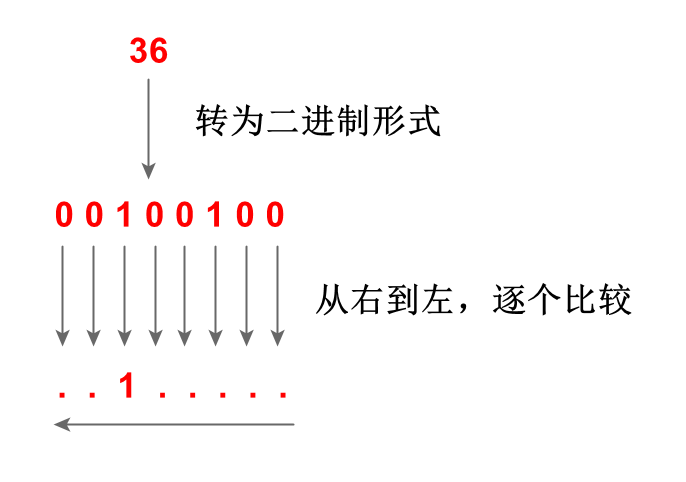

## 位掩码

在 SAS 中，位掩码（bit mask）被归类为一种特殊的常数（constant），通常用于进行比特位的检测。

位掩码由数字 0, 1 和点（.）组成，例如：`'1.0000'b`，为了与字符串常量区分，这里末尾的 `b` 是必要的。

在二进制计算机中，所有字符和数字都是以 0 和 1 的形式存储的，每一个 0 和 1 都被称作一个比特位。例如：字符 `a` 用比特位表示是 `01100001`，数值 `36` 用比特位表示是 `00100100`。

- 当位掩码用于字符串的比特位检测时，先将字符串以二进制形式表示出来，然后与位掩码**左**对齐，**从左到右**逐个检测比特位；
- 当位掩码用于数值的比特位检测时，先将数值以二进制形式表示出来，然后与位掩码**右**对齐，**从右到左**逐个检测比特位。

例如：

```sas
data a;
    a = 36;
    if a = '..1.....'b then put a "的第 3 个比特位是 1 !";
    else put a "的第 3 个比特位是 0 !";
run;
```



在这个例子，我们只检测数值 36 的第 3 个比特位，不关心其余比特位到底是 0 还是 1，因此，位掩码 `'..1.....'b` 的第 3 位是 1，其余比特位均为点，表示忽略这一个比特位的检测。

字符的比特位检测也是类似地，只不过字符的二进制形式还与具体的编码格式有关，这里篇幅受限就不具体展开了。

## 自动宏变量 SYSINFO

PROC COMPARE 过程用于比较两个数据集的差异，SAS 提供了一个名为 `SYSINFO` 的自动宏变量，每次进行数据集比较之后，都会在这个宏变量中存储一个返回码，该返回码包含了具体的比较结果。

`SYSINFO` 的具体数值和对应的比较结果信息如下表所示：

| 比特位 | 条件     | 返回码 | 二进制               | 描述                                           |
| ------ | -------- | ------ | -------------------- | ---------------------------------------------- |
| 1      | DSLABEL  | 1      | 0000 0000 0000 0001  | 数据集标签不一致                               |
| 2      | DSTYPE   | 2      | 0000 0000 0000 0010  | 数据集类型不一致                               |
| 3      | INFORMAT | 4      | 0000 0000 0000 0100  | 变量具有不同的输入格式                         |
| 4      | FORMAT   | 8      | 0000 0000 0000 1000  | 变量具有不同的输出格式                         |
| 5      | LENGTH   | 16     | 0000 0000 0001 0000  | 变量具有不同的长度                             |
| 6      | LABEL    | 32     | 0000 0000 0010 0000  | 变量具有不同的标签                             |
| 7      | BASEOBS  | 64     | 0000 0000 0100 0000  | base 数据集具有 compare 数据集中不存在的观测   |
| 8      | COMPOBS  | 128    | 0000 0000 1000 0000  | compare 数据集具有 base 数据集中不存在的观测   |
| 9      | BASEBY   | 256    | 00000 0001 0000 0000 | base 数据集具有 compare 数据集中不存在的 by 组 |
| 10     | COMPBY   | 512    | 00000 0010 0000 0000 | compare 数据集具有 base 数据集中不存在的 by 组 |
| 11     | BASEVAR  | 1024   | 0000 0100 0000 0000  | base 数据集具有 compare 数据集中不存在的变量   |
| 12     | COMPVAR  | 2048   | 0000 1000 0000 0000  | compare 数据集具有 base 数据集中不存在的变量   |
| 13     | VALUE    | 4096   | 0001 0000 0000 0000  | 具有不等值                                     |
| 14     | TYPE     | 8192   | 0010 0000 0000 0000  | 具有不同的变量类型                             |
| 15     | BYVAR    | 16384  | 0100 0000 0000 0000  | by 组的变量不匹配                              |
| 16     | ERROR    | 32768  | 1000 0000 0000 0000  | 致命错误：未进行比较                           |

PROC COMPARE 在比较数据集的过程中，如果发现以上任何一个条件满足，就将其返回码累加到自动宏变量 `SYSINFO` 中，因此，`SYSINFO` 存储的其实是所有比较结果的返回码的总和。

细心的你可能会发现，这里的返回码并不是连续的整数，而是 2 的幂。这样的设计其实是有意为之，观察这些返回码的二进制形式，可以发现它们都只有一个比特位上是 1，并且这个 1 所处的位置与其他返回码都错开了，这样无论 PROC COMPARE 的比较结果有多少种不同的情况，它们的返回码累加之后的二进制形式都保留了单个情形的比较结果。

例如：如果两个数据集使用 PROC COMPARE 进行比较后，宏变量 SYSINFO 的值是 48，二进制形式为 `0000 0000 0011 0000`，从右往左数，第 5、6 比特位是 1，因此可以得知，这两个数据集仅存在变量标签和变量长度的不一致，且 48 正好等于返回码 16、32 的总和。

有了以上的知识，我们可以编写以下程序来识别宏变量 `SYSINFO` 包含的数据集比较的具体差异：

```sas
/* 先捕获 SYSINFO 的值，否则会被下一个 PROC 或 DATA 步重置 */
%let _sysinfo = &sysinfo;
data _null_;
    if &_sysinfo = '...............1'b then put '数据集标签不一致!';
    if &_sysinfo = '..............1.'b then put '数据集类型不一致!';
    if &_sysinfo = '.............1..'b then put '变量具有不同的输入格式!';
    if &_sysinfo = '............1...'b then put '变量具有不同的输出格式!';
    if &_sysinfo = '...........1....'b then put '变量具有不同的长度';
    if &_sysinfo = '..........1.....'b then put '变量具有不同的标签';
    if &_sysinfo = '.........1......'b then put 'base 数据集具有 compare 数据集中不存在的观测!';
    if &_sysinfo = '........1.......'b then put 'compare 数据集具有 base 数据集中不存在的观测!';
    if &_sysinfo = '.......1........'b then put 'base 数据集具有 compare 数据集中不存在的 by 组!';
    if &_sysinfo = '......1.........'b then put 'compare 数据集具有 base 数据集中不存在的 by 组!';
    if &_sysinfo = '.....1..........'b then put 'base 数据集具有 compare 数据集中不存在的变量!';
    if &_sysinfo = '....1...........'b then put 'compare 数据集具有 base 数据集中不存在的变量!';
    if &_sysinfo = '...1............'b then put '具有不等值!';
    if &_sysinfo = '..1.............'b then put '具有不同的变量类型!';
    if &_sysinfo = '.1..............'b then put 'by 组的变量不匹配!';
    if &_sysinfo = '1...............'b then put '致命错误：未进行比较!';
run;
```
