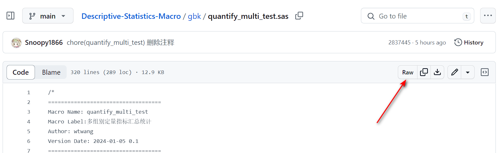
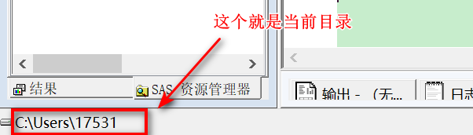

## 问题引出

我有时候会针对一些具体的场景编写很多宏程序，为了防止单个宏程序过于臃肿，会将重复的代码进行抽取，封装成一个个独立的程序单元。这其实有点类似面向对象中的基类，其他程序都在这些基类上进一步衍生，形成适用不同场景的宏程序。

举个例子，我写了一个宏 `%quantify_multi_test`，它调用了另一个宏 `%quantify_multi`，这个宏又调用了 `%quantify`，到此为止，`%quantify` 就是这条调用链中最底层的宏了。我必须事先导入后面两个宏程序，才能正确运行 `%quantify_multi_test`。人都是懒惰的，有没有什么办法在调用 `%quantify_multi_test` 的时候自动导入所需依赖呢？

## 如何实现

实现这一操作的前提是，需要将依赖程序的路径固定，本地存储肯定不行，可以借助 Github 将代码托管在网络上，并获取宏程序文件的固定链接。然后通过 SAS 提供的 `PROC HTTP` 过程自动下载固定链接的内容，使用 `%incldue` 语句导入依赖程序。

例如：

```sas
filename predpc "quantify_multi.sas";
%let url = %str(https://raw.githubusercontent.com/Snoopy1866/Descriptive-Statistics-Macro/main/gbk/quantify_multi.sas);
proc http url = "url" out = predpc;
run;
```

`url` 填写的是依赖程序的下载链接。<font color=red>注意</font>：这里并不是 quantify_multi.sas 文件在 Github 仓库中的路径，需要在对应页面点击 `RAW` 按钮，然后复制地址栏的链接。



`out = predpc` 表示将下载好的文件保存为 `predpc` 指向的路径，这里的路径是由 `filename` 语句定义的，`quantify_multi.sas` 被存储在当前目录下。



## 获得 HTTP 响应状态

PROC HTTP 仅仅是帮助我们向远程主机发出了下载依赖程序的指令，我们仍然需要进一步判断是否下载成功，如果下载失败，程序应当提前终止，并输出提示信息。

PROC HTTP 提供了两个宏变量：

- SYS_PROCHTTP_STATUS_CODE : 存储的是 HTTP 请求的状态码
- SYS_PROCHTTP_STATUS_PHRASE : 存储的是有关 HTTP 请求的状态码的描述信息

需要注意的是：HTTP 请求成功发出后，上述两个宏变量才会被创建；如果 HTTP 请求没有成功发出，以上两个宏变量都不会被创建。

因此可以编写下面的代码，判断是否下载成功：

```sas
%if %symexist(SYS_PROCHTTP_STATUS_CODE) %then %do;
    %if &SYS_PROCHTTP_STATUS_CODE = 200 %then %do;
        %include predpc;
    %end;
    %else %do;
        %put ERROR: 远程主机连接成功，但并未成功获取目标文件，请手动导入前置依赖 %nrbquote(%nrstr(%%))QUANTIFY_MULTI 后再次尝试运行！;
        %goto exit_with_error;
    %end;
%end;
%else %do;
    %put ERROR: 远程主机连接失败，请检查网络连接和代理设置，或手动导入前置依赖 %nrbquote(%nrstr(%%))QUANTIFY_MULTI 后再次尝试运行！;
    %goto exit_with_error;
%end;
```

`&SYS_PROCHTTP_STATUS_CODE = 200` 表示 HTTP 请求成功，由于默认的方法是 `GET`，因此表示资源已被提取并在消息正文中传输。因此可以使用 `%include` 语句导入依赖程序。

## 设置代理

可以通过两种方法设置代理。

### 使用 PROXYHOST 和 PROXYPORT 选项

```sas
filename predpc "quantify_multi.sas";
%let url = %str(https://raw.githubusercontent.com/Snoopy1866/Descriptive-Statistics-Macro/main/gbk/quantify_multi.sas);
proc http url = "&url" out = predpc
          proxyhost = "127.0.0.1"
          proxyport = 7890;
run;
```

### 使用自动宏变量 PROCHTTP_PROXY

```sas
%let PROCHTTP_PROXY = 127.0.0.1:7890;
filename predpc "quantify_multi.sas";
%let url = %str(https://raw.githubusercontent.com/Snoopy1866/Descriptive-Statistics-Macro/main/gbk/quantify_multi.sas);
proc http url = "url" out = predpc;
run;
```

### 参考链接

[HTTP 状态码速查](https://developer.mozilla.org/zh-CN/docs/Web/HTTP/Status)
