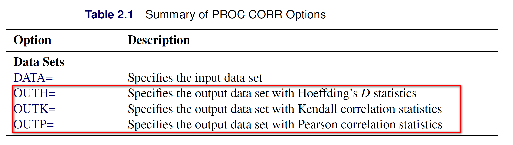
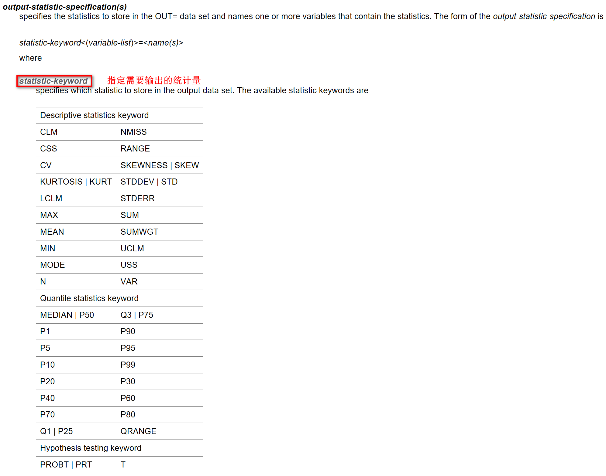
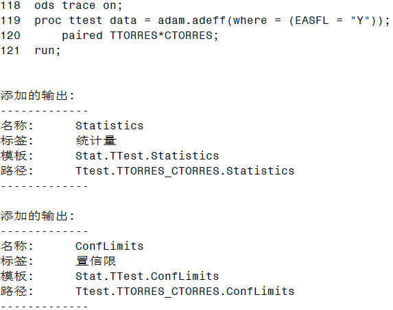
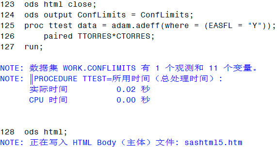
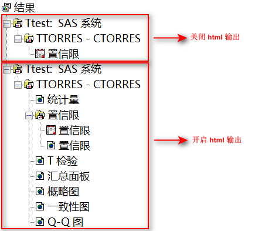
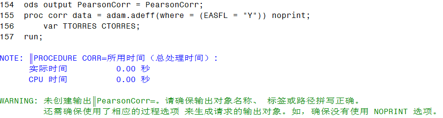

打印（Print）是一件非常消耗资源的事情，尤其是在编写宏程序时，最好将过程步的输出结果保存在数据集中，而不是默认输出到结果查看器中。如果宏程序内部调用的过程步特别多，会导致程序运行效率变慢，也会把结果查看器的内容弄得一团糟。

下面介绍几种方法，将过程步的运行结果直接保存到数据集中，避免“打印”操作拖慢程序运行效率。

### 使用 option

一些过程步提供了一些 option 用于输出部分运行结果，这些 option 有时候还不止一个。

例如：`PROC CORR` 就提供了将相关系数输出到数据集的几个选项。

```sas
proc corr data = adam.adeff(where = (EASFL = "Y")) outp = out noprint;
    var TTORRES CTORRES;
run;
```



- `OUTH` 指定输出 Hoeffding’s D 统计量的数据集
- `OUTK` 指定输出 Kendall 相关系数的数据集
- `OUTP` 指定输出 Pearson 相关系数的数据集

选项 `noprint` 是必须的，它相当于一个开关，用来控制过程步不要将输出结果展示出来，但可以输出到数据集中。


### 使用 output 语句

大多数过程步会专门提供一个 `output` 语句，解决运行结果的输出问题。

例如：`PROC MEANS` 过程，可以自由指定需要输出的统计量、

```sas
proc means data = adam.adeff(where = (EASFL = "Y")) n nmiss mean std median q1 q3 min max noprint;
    var TTORRES;
    output out = out n= nmiss= std= /autoname;
run;
```



### 使用 ods output 语句

极少数过程步既没有提供 option 选项，也没有提供 output 语句，这时候就只能祭出终极武器了：`ODS OUTPUT` 语句。

所有过程步都会提供一系列 ODS Table，用于保存过程步的所有输出对象（output object），具体有哪些 Table 可以在帮助文档中对应过程步的 Details -> ODS Table Names 标签下找到。

或者，在过程步运行前，打开 ODS 跟踪：

```sas
ods trace on;
proc ttest data = adam.adeff(where = (EASFL = "Y"));
    paired TTORRES*CTORRES;
run;
ods trace off;
```



使用 `ods trace on` 获取输出数据集名称之后，在过程步前面添加 `ods output` 语句即可。由于结果查看器实际上显示的是 ODS 语句输出的 html 文件，而我们的目的是尽可能减少不必要的输出，因此，还需要使用 `ods html close` 关闭 html 的输出。

```sas
ods html close;
ods output ConfLimits = ConfLimits;
proc ttest data = adam.adeff(where = (EASFL = "Y"));
    paired TTORRES*CTORRES;
run;
ods html;
```





<font color=red>**注意**</font>：使用 ods output 语句输出数据集时，不能同时使用 `noprint` 选项，因为 `noprint` 阻止了输出对象的创建。



### 使用 ods results off

正如前文所述，即便使用了 `ods html close`，过程步运行后仍然会在结果窗口中输出数据集，在需要长时间运行的任务中仍然会拖慢运行速度。

如果不需要事后跟踪运行过程中产生的数据集，可以使用 `ods results off` 直接关闭在结果窗口的输出。

```sas
ods results off;
ods output ConfLimits = ConfLimits;
proc ttest data = adam.adeff(where = (EASFL = "Y"));
    paired TTORRES*CTORRES;
run;
ods results on;
```
