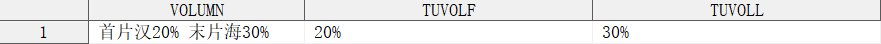

### 字符簇含有中文

GBK 环境下，单个中文字符使用 2 个字节存储，SAS 9.4 的正则相关函数是 I18N Level 0，并不适用于双字节字符集，强行使用也不是不可以，只是需要注意如果需要匹配的某个中文字符出现在字符簇元字符 `[]` 内时，需要额外指定重复次数为 2。

例如：

```sas
data test;
    VOLUMN = "首片：20% 末片: 30%";

    reg_id = prxparse("/(?:首片[：:]{1,2}\s*(\d+%))?\s*(?:末片[：:]{1,2}\s*(\d+%))?/o");
    if prxmatch(reg_id, VOLUMN) then do;
        TUVOLF = prxposn(reg_id, 1, VOLUMN);
        TUVOLL = prxposn(reg_id, 2, VOLUMN);
    end;

    drop reg_id;
run;
```

上述例子，变量 `VOLUMN` 包含首片肿瘤和末片肿瘤样本含量信息，需要提取字符串 `20%` 和 `30%`，并分别存储到变量 `TUVOLF` 和 `TUVOLL` 中。由于正则表达式相关函数并不支持双字节字符集，因此会将上述表达式中的所有单个中文字符视为 2 个单字节字符。

在上述正则表达式中，`[：:]{1,2}` 实际上相当于 `[\xA3\xBA\x3A]{1,2}`，在 SAS 看来，字符簇内实际上有 3 个单字节字符，分别为：`\xA3`、`\xBA`、`\x3A`，前两个字符实际上是中文冒号 `：` 占用的双字节拆分出来的两个单字节字符的十六进制表示，`\x3A` 是英文冒号的十六进制表示。

如果仅仅使用 `[：:]` 进行匹配，则只能匹配到 `\xA3`、`\xBA`、`:` 这几个字符的其中一个，而无法匹配中文冒号 `：`。加上 `{1,2}`，则可以匹配以下十六进制编码组合：

| 编码组合 | 解码字符 |
| -------- | -------- |
| \xA3     |          |
| \xBA     |          |
| \x3A     | :        |
| \xA3\xA3 | ＃       |
| \xA3\xBA | ：       |
| \xA3\x3A |          |
| \xBA\xA3 | 海       |
| \xBA\xBA | 汉       |
| \xBA\x3A |          |
| \x3A\xA3 |          |
| \x3A\xBA |          |
| \x3A\x3A | ::       |

其中，`\xA3\xBA` 的编码组合正好是中文冒号 `：`，因此 `[：:]{1,2}` 可以匹配。与此同时，我们发现有一些编码组合可以解码为有意义的字符，比如：`\xA3\xA3`、`\xBA\xA3`、`\xBA\xBA`，分别表示全角井号 `＃`、汉字 `海` 和 `汉`。我们可以写一段程序进行测试：

```sas
data test;
    VOLUMN = "首片汉20% 末片海30%";

    reg_id = prxparse("/(?:首片[：:]{1,2}\s*(\d+%))?\s*(?:末片[：:]{1,2}\s*(\d+%))?/o");
    if prxmatch(reg_id, VOLUMN) then do;
        TUVOLF = prxposn(reg_id, 1, VOLUMN);
        TUVOLL = prxposn(reg_id, 2, VOLUMN);
    end;

    drop reg_id;
run;
```

输出结果：



可以发现，即便变量 `VOLUMN` 中不含中文冒号 `：`，由于 SAS 将双字节字符处理成两个单字节字符，程序意外地匹配上了正则表达式。
