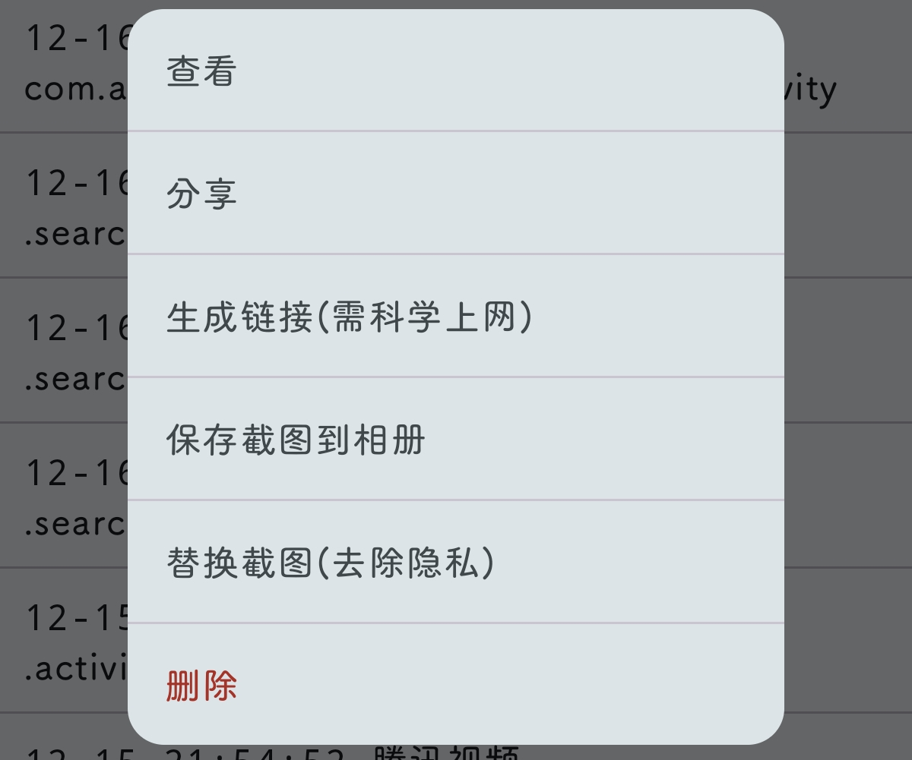
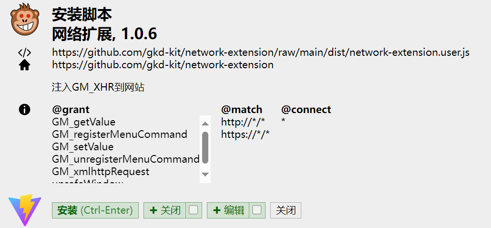
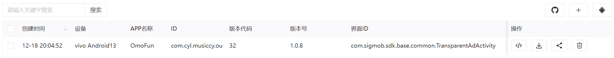
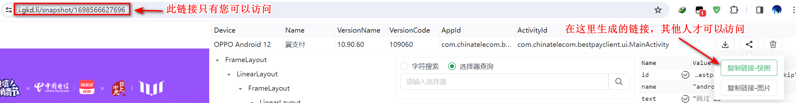
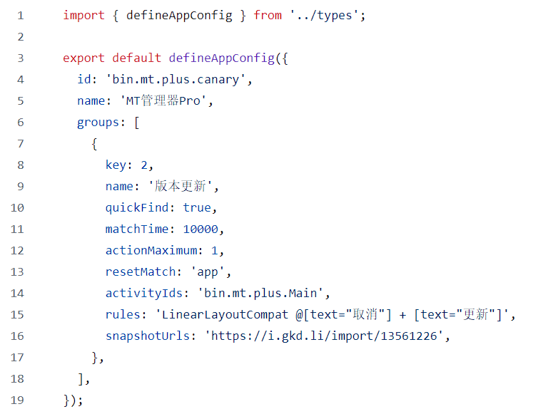

# GKD 规则编写教程

温馨提示：GKD 规则编写有一定难度，如果你打算自行编写 GKD 规则，请耐心看完本文档。

编写 GKD 规则差不多相当于在写代码，建议使用 PC 进行 GKD 规则的编写，以获得最佳的编码体验。代码本质上是纯文本，因此你也可以尝试在手机上使用任何文本编辑器编写 GKD 规则。以下所有内容均在 PC 完成，手机端请自行摸索。

## 1. 准备工具

- 一台 PC
- 一部安卓手机
- 一双手
- 一个聪明的大脑

你需要在 PC 上下载以下软件：

- 支持扩展的浏览器，例如：Chrome，Edge
- 文本编辑器，推荐 Visual Studio Code
- Git（可选）
- Node.js（可选）
- Github Desktop（可选）

你需要在安卓手机上下载以下软件：

- GKD

## 2. 使用 GKD 获取快照

GKD 使用无障碍权限获取到某个广告弹窗的界面元素信息，并可以通过快照将界面元素信息永久保存，便于规则的书写和维护。

<font color=red>PS</font>：快照不同于截图。截图仅包含界面的图像信息，而快照不仅包含界面的图像信息，还包含界面的元素信息，例如控件的名称和属性，以及控件与控件之间的位置关系信息。

编写规则的第一步是需要获取广告弹窗的快照，GKD 提供了 4 种方式获取某个广告弹窗的快照：

### 2.1 网页审查工具

对于开发者，推荐使用网页审查工具获取快照。

在网页审查工具中，点击右上角安卓机器人图标，再点击“快照”按钮即可抓取屏幕当前界面的快照。


如果你使用网页审查工具，捕获到的快照将会保存在本地，在审查工具中可直接查看快照文件的所有信息。有关如何搭建并使用审查工具的详细介绍请跳转至：[网页审查工具](#4-配置网页审查工具)

### 2.2 悬浮窗服务

对于普通用户，推荐使用悬浮窗服务获取快照。

打开 GKD → 设置 → 高级模式 → 开启悬浮窗服务，切换到广告弹窗界面，点击快照按钮，出现“快照成功”即代表成功获取当前界面的快照。

### 2.3 音量快照

如果悬浮窗按钮不工作，您可以尝试使用音量快照。

打开 GKD → 设置 → 高级模式 → 开启音量快照，切换到广告弹窗界面，改变系统音量，出现“快照成功”即代表成功获取当前界面的快照。

### 2.4 快捷开关

使用快捷开关按钮可快速获取快照，而无需事先或临时切换至 GKD 开启相应服务。

切换到广告弹窗界面，下拉状态栏，点击快照按钮，出现“快照成功”即代表成功获取当前界面的快照。

## 3. 分享快照文件

如果您使用网页审查工具获取了快照，可忽略这一步。

### 3.1 快照文件保存位置

你可以直接在文件管理器中找到上一步获取的快照文件，GKD 快照保存路径：

- /storage/emulated/0/Android/data/li.songe.gkd/files/snapshot/
- /storage/emulated/0/Android/data/li.songe.gkd/cache/snapshotZip/

优先查看文件夹 snapshotZip，这里面保存了快照的 .zip 文件，如果找不到就去文件夹 snapshot，这里面的快照文件需要手动压缩成 .zip 文件。

部分系统可能无法使用系统自带文件管理器查看该目录，可以使用 MT 管理器查看。

### 3.2 快照文件分享

你还可以在快照记录中找到上一步获取的快照，直接分享或生成链接。



- 选择“分享”菜单会将快照文件以压缩包的格式发送给你指定的位置。

- 选择“生成链接”会将文件上传并生成一个类似 https://i.gkd.li/import/12345678 的链接，其他人可以通过此链接查看这个快照文件的所有信息。此外，您可能需要借助一些网络工具才能生成快照的链接。

## 4. 网页审查工具的使用

### 4.1 配置网页审查工具

1. 打开 GKD → 高级模式 → 打开 HTTP 服务。此时会显示 3 个地址，类似下图：
   
   这里有 3 个地址，分别为：http://192.168.0.107:8888, http://10.4.191.102:8888, http://172.19.0.1:8888
   这三个地址都是局域网地址，这里先不用管，后续会用到。

2. 打开 https://i.gkd.li/
   

3. 点击右上角安卓机器人图标，输入设备地址（就是步骤 1 开启 HTTP 服务后显示的地址，一般用 192.168 开头的那个）
   

4. 点击刷新连接，即可连接至手机端 GKD 的 HTTP 服务。
   <font color = red>注意</font>：首次连接 HTTP 服务时，大概率会弹出 “**访问其它域名资源失败**” 提示，根据提示安装油猴脚本并注入即可，步骤如下：

5. 下载并安装浏览器扩展，安装任意一个脚本管理器均可。
   

6. 进入 https://github.com/gkd-kit/network-extension ，点击任意一个链接安装脚本。
   

   

7. 打开 https://i.gkd.li/ ，点击浏览器地址栏右侧的脚本管理器，再次点击【注入 GM_XHR】到当前网站即可。
   

8. 成功连接到手机端 GKD 的 HTTP 服务。
   

### 4.2 导入快照文件

通过步骤 [3.2](#32-快照文件分享) 分享的快照是一个 .zip 压缩文件，进一步查看快照信息需要使用网页审查工具。

打开 https://i.gkd.li/ ，点击右侧 + 号按钮 → 导入本地文件，选择快照文件即可，导入成功的快照会以列表形式展示在网页中。



此外，在网页审查工具中，成功连接设备后，您可以点击【快照】按钮，自动获取手机当前界面的快照，并以列表形式展示在网页中。


### 4.3 查看快照文件信息

在网页审查工具中，点击快照列表右侧的【查看】按钮或【</>】按钮，即可查看快照文件包含的所有信息。下图展示了审查工具界面各个 UI 的功能。


### 4.4 导出快照链接

浏览器地址栏的链接仅供您自身在局域网内访问，如果您需要将快照分享给其他人，可以点击右侧【分享】按钮 → 【复制链接-快照】，获取快照链接。



## 5. 选择器语法介绍

在阅读以下内容时，请确保已经按照 [4.1](#41-配置网页审查工具) 的步骤成功配置好网页审查工具。

选择器语法官方文档：https://gkd.li/selector/

前面讲到，书写 GKD 规则实际上就是在写一段代码，大部分时候，对于不同广告弹窗，GKD 规则代码的结构大体上是一样的，我们最关注的是其中的 **rules** 字段（规则代码含有多个字段，rules 是其中一个字段，其余字段我们现在不用关注，后面会逐一介绍）。

### 5.1 字段的含义

字段是什么？如果你没有任何编程经验，你可以简单理解为规则的一种属性？还是有点抽象？那我再举个例子，我们描述一个人，会描述他/她的姓名、性别、年龄、身高、体重等等，姓名、性别、年龄...这些概念都可以被称作人的属性。类似地，一条 GKD 规则，它不仅仅包含了这条规则本身，还包含了规则应用的 APP 名称、规则应用的活动界面 ID、规则的描述、规则的冷却时间、规则的匹配时间等等，这些都是 GKD 规则的属性，GKD 规则语法提供了若干字段用于定义上述属性。我们需要着重关注的规则本身实际上就是定义在 GKD 规则的 rules 字段中。

如果你有任何一门面向对象编程的经验，应该很容易理解上述文字的意思。部分编程语言中，字段和属性的含义略有区别，这里就不去纠结这个了，统一模糊处理。

### 5.2 控件的含义

安卓 APP 界面是由控件组成的，一个按钮，一个选择框，一个输入框，都称为一个控件。控件也包含若干属性，正如 [4.3](#43-查看快照文件信息) 中审查工具右侧显示的属性列表那样，控件 ID、名称、高度、宽度等等均是控件的属性。

### 5.3 选择器的结构

字段 rules 的值通常是一个选择器，选择器由**属性选择器**和**关系选择器**交叉组成。

#### 5.3.1 属性选择器

在审查工具中，用鼠标在左侧截图中随意定位一个控件，即可在右侧查看该控件的所有属性，属性选择器正是通过这些属性来确定一个控件的。

例如：在快照 https://i.gkd.li/import/13348703 中，我们定位到“跳过”按钮，右侧显示该按钮的所有属性。其中 text 属性是 "跳过"，这是一个字符串，因此，我们可以用以下属性选择器定位这个控件：

```
android.widget.TextView[text="跳过"]
```

其中，`android.widget.TextView` 是这个控件的名称，可以在审查工具右侧属性列表的 `name` 中找到，中括号内部使用了 `text` 属性进一步限定，`text="跳过"` 保证了该属性选择器定位到的控件的 `text` 属性的值必须是 `"跳过"`。

由于是在安卓平台使用，`android.widget` 通常可以省略，为了简化书写，上述属性选择器可以简化为：

```
TextView[text="跳过"]
```

将上述选择器复制到审查工具的选择器查询框中，点击右侧查询按钮，可对选择器的语法进行测试，如果语法正确并且找到了符合选择器条件的控件，将会显示：选择到 x 个节点。


---

有些时候，“跳过”按钮的 `text` 属性值可能不仅仅包含字符串`"跳过"`，例如这个快照：https://i.gkd.li/import/13055542

在这个快照中，跳过按钮的 `text` 属性值为 `"跳过2s"`，容易想到，这是一个含有倒计时读秒的跳过按钮。属性选择器 `TextView[text="跳过"]` 并不能定位到该控件，如果写成 `TextView[text="跳过2s"]` 则只能在倒计时 2s 的时候成功定位。事实上，这提示我们：操作符 `=` 的含义是完全匹配，它并不能进行模糊匹配。

使用字符串操作符 `^=` 可以实现模糊匹配，例如：

```
TextView[text^="跳过"]
```

`^=` 表示匹配以 xxx 开头的字符串，类似的字符串操作符还有：

- `=` : 匹配与 xxx 相同的字符串
- `^=` : 匹配以 xxx 开头的字符串
- `$=` : 匹配以 xxx 结尾的字符串
- `*=` : 匹配包含 xxx 的字符串
- `!=` : 匹配与 xxx <font color=red>**不**</font>同的字符串
- `!^=` : 匹配<font color=red>**不**</font>以 xxx 开头的字符串
- `!$=` : 匹配<font color=red>**不**</font>以 xxx 结尾的字符串
- `!*=` : 匹配<font color=red>**不**</font>包含 xxx 的字符串

---

有些时候，跳过按钮可能不是 `TextView` 控件，例如这个快照：https://i.gkd.li/import/12917007

在这个快照中，跳过按钮的是一个 `Button` 控件，属性选择器 `TextView[text^="跳过"]` 并不能定位到这个控件，应该将 `TextView` 改为 `Button`，即：

```
Button[text^="跳过"]
```

更进一步，我们可以使用 `*` 代替中括号前面的 `TextView` 或 `Button`，即：

```
*[text^="跳过"]
```

`*` 表示任意控件，可以是 `TextView`，`Button`，`ImageView` 等等，`*` 可以省略，上述属性选择器可以进一步简化为：

```
[text^="跳过"]
```

---

在实际书写开屏广告规则时，为了防止某些 APP 偶有开屏不显示广告直接进入首页，此时恰好首页存在某个控件的 `text` 属性含有字符串 `"跳过"`，造成错误点击的情况发生，需要对上述属性选择器作进一步限制。例如：

```
[text^="跳过"][text.length<=10]
```

这里第二个中括号内部使用了控件的另一个属性 `text.length`，同样可以在审查工具右侧的属性列表中找到。两个中括号之间的是逻辑与的关系，即控件必须同时满足两个中括号内的限定条件。通常，开屏广告的跳过按钮内部显示的文字有限，比较操作符 `<=` 限制了该属性选择器定位到的控件的文本的长度。对应上述属性选择器，这个限制是 10 个字符（注意：双字节字符依然只算一个字符）。

更多比较操作符的含义如下：

- `=` : 等于
- `!=` : 不等于
- `>` : 大于
- `<` : 小于
- `>=` : 大于等于
- `<=` : 小于等于

可以对属性选择器添加更多的限制条件，例如：

```
[text^="跳过"][text.length<=10][clickable=true][visibleToUser=true]
```

#### 5.3.2 关系选择器

[5.3.1](#531-属性选择器) 部分仅涉及到一个属性选择器，很多情况下，仅靠一个属性选择器可能无法准确定位某个控件，或使用一个属性选择器存在潜在的误触风险，此时我们需要联合两个或更多属性选择器。多个属性选择器中，只能有一个属性选择器查询到的控件为**目标控件**（实际点击的控件），其余属性选择器查询到的控件均为**特征控件**，通过定义特征控件与目标控件之间的位置关系，进一步限制了目标控件的查询范围，**最终的目标是：选择器查询结果唯一，并尽可能减少潜在的误触的风险**。

##### 5.3.2.1 兄弟节点（+，-）

以 https://i.gkd.li/import/13561226 这个快照中的更新弹窗为例，在这个快照中，我们想要达成的效果是：自动点击 【取消】按钮，那么目标控件的属性选择器是：

```
[text="取消"]
```

由于字符串 `"取消"` 在 APP 界面中较为常见，仅靠上述一个属性选择器对控件进行定位，可能存在误触的风险，因此还需要引入更多属性选择器进一步限制。查看左侧节点树的控件信息，我们可以发现字符串 `"更新"` 比较适合作为进一步的限制条件。试想，某个 APP 界面同时存在字符串 `"取消"` 和 `"更新"` ，那么它大概率是一个更新弹窗，而不太可能是其他类型的弹窗。

因此，我们可以写下 【更新】按钮的属性选择器：

```
[text="更新"]
```

现在的问题是，如何将这两个属性选择器联系起来呢？这就要用到关系选择器了。

观察【取消】按钮和【更新】按钮在左侧节点树中的位置关系，不难发现，他们都处于同一个 `LinearLayout` 分支下，并且两个控件是相邻的，中间没有其他任何控件，类似这样的控件位置关系，我们称之为“**兄弟关系**”，“兄弟”之间是存在大小的，同一个分支下，位置越往上的控件，它的排行越靠前。在上述例子中，【取消】按钮的位置更靠上，因此，它的排行比【更新】按钮更靠前。

使用**关系操作符** `+` 可以连接两个兄弟关系的节点，例如：

```
[text="取消"] + [text="更新"]
```

⚠ 注意：`+` 与左右两侧的属性选择器之间必须空一格，否则会导致语法错误。

上述选择器包含了左右两个属性选择器和中间的关系选择器，这里的关系选择器非常简单，就是一个表示两侧属性选择器之间是兄弟关系的关系操作符 `+`。另外，由于【取消】按钮的排行比【更新】按钮的排行更靠前，因此 `[text="取消"]` 在关系操作符 `+` 的左侧，`[text="更新"]` 在右侧。

_另外，我们还可以在审查工具右侧的属性列表中发现，【取消】按钮的 `index` 属性值为 0，【更新】按钮的 `index` 属性值为 1，两个属性选择器谁在左侧谁在右侧本质上是由 `index` 属性值决定的，`a + b` 的含义是：a.index + 1 = b.index_

将上述选择器复制到审查工具中，点击查询，我们会发现成功找到了 1 个控件，然而，找到的控件并非我们想要的 【取消】按钮，而是【更新】按钮，可以说与我们期望的效果完全相反，这是为什么呢？

其实，上述选择器包含的两个属性选择器对应了节点树中的两个不同的控件，审查工具无法确定哪一个控件是目标控件，因此，默认情况下，会将选择器最末尾的属性选择器对应的控件作为目标控件。在这个例子中，最末尾的属性选择器对应的是【更新】按钮，因此审查工具将【更新】按钮作为目标控件。

可以使用符号 `@` 手动指定某个属性选择器作为目标控件，将符号 `@` 放置在属性选择器前面即可，例如：

```
@[text="取消"] + [text="更新"]
```

将上述选择器复制到审查工具中，可以发现这次查询到的目标控件为【取消】按钮。

在这个例子中，如果你不想使用符号 `@`，也可以使用关系操作符 `-`，它的作用与关系操作符 `+` 完全相反，例如：

```
[text="更新"] - [text="取消"]
```

##### 5.3.2.2 父子节点（>，<）

以 https://i.gkd.li/import/12776605 这个快照中的更新弹窗为例，在这个快照中，我们想要达成的效果是：自动点击 【取消】按钮，那么目标控件的属性选择器是：

```
[text="取消"]
```

可以将 【立即下载】、【应用升级提醒】按钮作为特征控件，为了说明关系操作符 `>` 的用法，这里我们选择【应用升级提醒】按钮，它的属性选择器是：

```
[text="应用升级提醒"]
```

如何将上面两个属性选择器联系起来呢？观察左侧节点树，可以发现，特征控价和目标控件并不是兄弟关系，【立即下载】位于一个名为 `LinearLayout` 的控件的分支下，这个 `LinearLayout` 控件与【应用升级提醒】是平级的。因此，我们可以借助 `LinearLayout` 作为中间桥梁，搭建一条路径将目标控件和特征控件联系起来。

首选使用关系操作符 `+` 建立【应用升级提醒】与 `LinearLayout` 控件的联系：

```
[text="应用升级提醒"] +3 LinearLayout
```

_这里的关系选择器是 `+3`，数字 3 表示左侧控件和右侧控件的距离是 3，也即：`左侧控件.index + 3 = 右侧控件.index`。类似地，a +n b 表示 a.index +n = b.index，如果 n = 1，则 n 可以省略。[详细了解](#53232-多项式表达式)_

然后，使用关系操作符 `>` 建立 `LinearLayout` 与 【立即下载】的联系：

```
[text="应用升级提醒"] +3 LinearLayout > [text="取消"]
```

实际书写规则时，建议将 `LinearLayout` 替换为 `*`，因为我们只需要一个控件作为中间桥梁，构建特征控件与目标控件的联系，至于作为中间桥梁的控件具体是什么，我们并不关心，它有可能是 `LinearLayout`、`FrameLayout`、`View` 等等。因此，上述选择器可以优化为：

```
[text="应用升级提醒"] +3 * > [text="取消"]
```

关系操作符 `>` 表示左侧控件与右侧控件是**父子关系**，体现在节点树中，左侧控件相比右侧控件向左缩进了一个单位。

_另外，我们还可以在审查工具右侧的属性列表中发现，【取消】按钮的 `depth` 属性值为 9，LinearLayout 的 `depth` 属性值为 8，两个属性选择器谁在左侧谁在右侧本质上是由 `depth` 属性值决定的，`a > b` 的含义是：a.depth + 1 = b.depth_

上面的例子也可以使用关系操作符 `<` 进行改写，如下：

```
@[text="取消"] < * -3 [text="应用升级提醒"]
```

##### 5.3.2.3 关系表达式

前面介绍的 `+`、`-`、`>`、`<` 都是关系操作符，它们都可以和**关系表达式**组合，形成更强大的关系选择器。元组表达式又分为**元组表达式**和**多项式表达式**。

###### 5.3.2.3.1 元组表达式

以 https://i.gkd.li/import/12706102 和 https://i.gkd.li/import/13761641 这两个快照中的广告弹窗为例，在这两个快照中，我们想要达成的效果是：自动点击广告弹窗下方的 【x】按钮。

如果你看过 [5.3.2.1](#5321-兄弟节点) 的内容，对于第一个快照，可以很容易地写下如下选择器：

```
[id="com.gotokeep.keep:id/layoutLottie"] + [id="com.gotokeep.keep:id/imgCloseHomePageDialog"]
```

对于第二个快照，可以写下如下选择器（`+n` 的用法我们已经在 [5.3.2.2](#5322-父子节点) 中了解到了。）：

```
[id="com.gotokeep.keep:id/layoutLottie"] +2 [id="com.gotokeep.keep:id/imgCloseHomePageDialog"]
```

上面两个选择器的结构如此相似，有没有什么办法合二为一呢，这就要用到元组表达式了。元组表达式长下面这个样子：

$$
(a_1,a_2,a_3,...,a_n)
$$

其中 $a_1,a_2,a_3,...,a_n$ 这是一个常量有序**递增**正整数，例如：`(1)`、`(1,2,3)`、`(2,3,7,11)` 都是元组表达式，而 `(5,3)` 是非法的元组表达式。

将关系操作符 `+` 与元组表达式结合，就能将上面两个选择器合二为一：

```
[id="com.gotokeep.keep:id/layoutLottie"] +(1,2) [id="com.gotokeep.keep:id/imgCloseHomePageDialog"]
```

对于关系操作符 `-`、`>`、`<`，都有同样的用法：

- $-(a_1,a_2,a_3,...,a_n)$
- $>(a_1,a_2,a_3,...,a_n)$
- $<(a_1,a_2,a_3,...,a_n)$

###### 5.3.2.3.2 多项式表达式

元组表达式只能表示有限个元素，如果需要描述这样一种控件关系：a 与 b 是兄弟关系，且 a 和 b 之间的距离是奇数，则必须使用多项式表达式。

多项式表达式长下面这个样子：

$$
(an+b)
$$

其中 $a$ 和 $b$ 都是常量整数，$n$ 从 1 开始递增，该表达式能表示的数字集合为 $\{an+b|an+b\ge 1,n\ge 1\}$。

例如：`+(2n)` 表示偶数集合、`+(2n-1)` 表示奇数集合。

理论上，多项式表达式可以表示包含无限多元素的数字集合，但应用到实际情况中，同一个节点树上，`index` 和 `depth` 的值是有上限的，因此多项式表达式表示的数字集合包含的有效元素个数是有限的。

例如：控件 `ImageView` 和 `TextView` 是兄弟关系，且它们的父节点下存在 10 个子节点，那么关系选择器 `ImageView +(2n+3) TextView` 最多同时包含以下三种具体情况：

```
ImageView +5 TextView
ImageView +7 TextView
ImageView +9 TextView
```

如果考虑到这 10 个子节点中 `ImageView` 的位置可能不是自由的，能包含的情况就更少了（例如：`ImageView.index = 3` 时，上述选择器仅能表示一种情况：`ImageView +5 TextView`）。

了解以上的内容，我们来尝试将 [5.3.2.3.1](#53231-元组表达式) 中的两个快照的选择器用多项式表达式合并一下。

当然，我们首先可以很容易地想到，使用最简单的 `+(1n+0)` 即可：

```
[id="com.gotokeep.keep:id/layoutLottie"] +(1n+0) [id="com.gotokeep.keep:id/imgCloseHomePageDialog"]
```

正如上面所说，我们不必担心 `n` 从 1 开始递增会导致死循环，因为它们的父节点下的节点数量是有限的。

另外，如果 $a=1，b=0$，则 $(an+b)$ 可以简化为 $(n)$（[详细了解](#53233-表达式的简写)），因此上述选择器可以优化为：

```
[id="com.gotokeep.keep:id/layoutLottie"] +(n) [id="com.gotokeep.keep:id/imgCloseHomePageDialog"]
```

括号在这里也已经失去了区分关系操作符 `+` 和算数运算符 `+` 的作用，因此可以省略：

```
[id="com.gotokeep.keep:id/layoutLottie"] +n [id="com.gotokeep.keep:id/imgCloseHomePageDialog"]
```

当然，我们也可以使用以下选择器，在数学原理上避免死循环：

```
[id="com.gotokeep.keep:id/layoutLottie"] +(3-n) [id="com.gotokeep.keep:id/imgCloseHomePageDialog"]
```

- 当 `n=1` 时，`+(3-n)` 等价于 `+2`;
- 当 `n=2` 时，`+(3-n)` 等价于 `+1`;
- 当 `n=3` 时，`+(3-n)` 等价于 `+0`，此时关系选择器非法，循环终止。

###### 5.3.2.3.3 表达式的简写

这部分内容没什么好写的，直接照搬 [官方文档](https://gkd.li/selector/#connect-shortcut)。

[5.3.2.3.2](#53232-多项式表达式) 中的多项式表达式在特定情况下可以简写。

- 当 a=0 或 b=0 时，括号可以省略，例如：`A +(3n+0) B` -> `A +3n B`，`A +(0n+3) B` -> `A +3 B`
- 当 a=0 且 b=1 时，an+b 可以省略，例如：`A <(0n+1) B` -> `A < B`
- 当 a=1 且 b=0 且操作符是 `>` 时，可以进一步简写，例如：`A >(1n+0) B` -> `A >n B` -> `A B`

## 6. GKD 规则字段介绍

一个完整的 GKD 规则包含很多字段，前面介绍的 `rules` 字段只是其中一个，完整的字段介绍可参考 [API](https://gkd.li/api/)。

在默认订阅的规则仓库中，导航到文件夹 `src/apps/`，里面包含已经适配好的所有 app 的规则文件，后缀名为 `.ts`，一个 app 对应一个 `.ts` 文件。随便打开一个规则文件，可以发现包含很多字段，以及字段的具体值。



下面介绍一些常用的字段。

### id

app 的包名，可以在网页审查工具中查看。

### name

app 的名称，可以在网页审查工具中查看。

### group

app 的规则组，它应当是一个数组，因此它的值使用中括号 `[]` 包围。一个 app 可以定义多个规则组，每个规则组是一个对象，因此使用大括号 `{}` 包围。

---

**以下字段需定义在规则组中：**

### key

规则组的唯一标识，设置后不可更改。

### name

规则组的名称。

### activityIds

规则组应用的活动界面 ID。一个规则组可以应用在一个 activityId，也可以同时应用在多个 activityIds 上。例如：

```json5
activityIds: 'bin.mt.plus.Main',
```

或者

```json5
activityIds: ['com.android.browser.BrowserActivity',
              'com.android.browser.flow.view.FeedbackDialog',]
```

### rules

规则组的规则本体。这个字段存储的值就是 [#5](#5-选择器语法介绍) 中介绍的选择器。例如：

```json5
rules: '[id="cover-img"] + [text="关闭推荐"]',
```

### snapshotUrls

规则组的快照链接。这个字段是可选的，如果你希望编写可维护的规则，不要遗漏这个字段。快照链接可通过 [4.4](#44-导出快照链接) 的方法导出。

使用以上字段，可完成**绝大多数** GKD 规则的编写。 其他字段的重要性不是那么大，限于篇幅就不逐一介绍了，可自行查看 [API](https://gkd.li/api/)。

## 7. 编写和测试规则

---TODO--

### 7.1 执行选择器

### 7.2 编写规则文件

### 7.3 内存订阅与本地订阅

## 8. 规则优化

### 8.1 同类规则的合并

### 8.2 开屏广告的特殊性

### 8.3 七种触发事件

### 8.4 `quickFind` 字段的使用

### 8.5 优先选择 `clickable=true` 的控件

### 8.6 `macthes` 数组的使用

### 8.7 `<<` 操作符

### 8.8 ...
